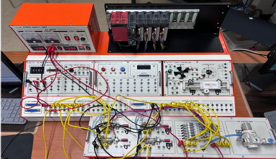

# PLC 기반 부품 자동 세척 공정 제어 시스템

공압 실린더와 센서를 이용해 부품의 투입, 고정, 세척, 배출 과정을 자동화한 PLC 프로젝트입니다.

---

## 프로젝트 소개

드릴 및 밀링 작업을 거친 부품의 세척 공정을 자동화하기 위해 제작한 프로젝트입니다.

4개의 공압 실린더와 위치 센서를 이용해 부품 투입부터 고정, 세척기 이동, 배출까지 순서대로 동작하도록 구성했습니다. PLC 내부 메모리와 센서 신호를 이용해 현재 공정 단계를 저장하고, 각 단계가 완료되면 다음 단계로 넘어가도록 Ladder 로직을 작성했습니다.

---

## 전체 동작 순서

1. 시작 버튼을 누르면 자동 세척 공정이 시작됩니다.
2. A 실린더가 1번 컨베이어의 부품을 세척 테이블로 밀어냅니다.
3. B 실린더가 부품을 움직이지 않도록 고정합니다.
4. C 실린더가 고정된 부품을 세척기 안으로 이동시킵니다.
5. 세척 완료 신호가 들어오면 B 실린더가 부품 고정을 해제합니다.
6. D 실린더가 세척이 끝난 부품을 2번 컨베이어로 밀어냅니다.
7. C 실린더가 원래 위치로 돌아갑니다.
8. 모든 실린더가 원위치로 복귀하면 다음 부품의 세척을 반복합니다.

---

## 실린더 역할

| 실린더 | 역할 |
|---|---|
| A 실린더 | 1번 컨베이어의 부품을 세척 테이블로 투입 |
| B 실린더 | 세척 중 부품이 움직이지 않도록 고정 및 해제 |
| C 실린더 | 고정된 부품을 세척기 안으로 이동하고 원위치 복귀 |
| D 실린더 | 세척이 끝난 부품을 2번 컨베이어로 배출 |

---

## 주요 제어 방식

### 시퀀스 제어

각 실린더가 정해진 순서에 따라 동작하고, 위치 센서의 신호를 확인한 뒤 다음 단계로 넘어가도록 구성했습니다.

### 인터록 제어

한 실린더의 전진 출력과 후진 출력이 동시에 켜지지 않도록 조건을 설정했습니다.

또한 부품이 정상적으로 고정되지 않은 상태에서는 세척 단계로 넘어가지 않도록 하여 실린더 간 충돌과 공정 오류를 줄였습니다.

---

## 입출력 구성

| 입력 장치 | 기능 |
|---|---|
| `X00` | 시작 버튼 |
| `X01 ~ X08` | 각 실린더 위치 확인 센서 |
| `X09` | 세척 완료 신호 |

| 출력 장치 | 기능 |
|---|---|
| `Y21`, `Y22` | A 실린더 전진·후진 |
| `Y23`, `Y24` | B 실린더 전진·후진 |
| `Y25`, `Y26` | C 실린더 전진·후진 |
| `Y27`, `Y28` | D 실린더 전진·후진 |

---

## 내가 맡은 부분

- 프로젝트 선정 배경과 필요성 정리
- 연구 목표 작성
- 각 실린더의 역할과 전체 공정 순서 정리
- 센서 구성과 PLC 내부 메모리 동작 분석
- 실린더 전진·후진 동시 출력을 막기 위한 인터록 조건 정리
- 결과 보고서 작성 보조

---

## 프로젝트 파일

## 프로젝트 파일

- [PLC 제어 프로젝트 보고서 PDF 보기](./PLC제어_보고서%20%281%29.pdf)
